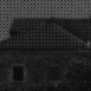
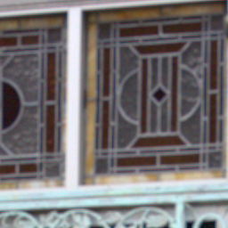
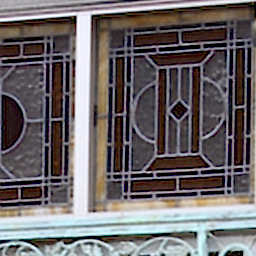
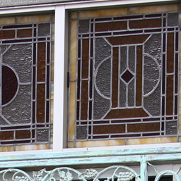

# 🌟 Open-AISP

**Open-AISP** is a toy-level, and open-source AI-ISP (Artificial Intelligence Image Signal Processor) pipeline framework for beginners. The overall workflow of this AISP aligns with standard industry practices for image signals processing. It aims to provide an end-to-end solution ranging from realistic raw image degradation simulation to neural image reconstruction and enhancement.

## 📚 Documentation

| Language | Entry |
| :---: | :--- |
| 🌐 English | [English Documentation](https://www.coolsyn.top/Open-AISP/) |
| 🇨🇳 中文 | [中文文档](https://www.coolsyn.top/Open-AISP/zh/) |

## 🗓️ Timeline

| Date | Update |
| :--- | :--- |
| 2026-04-27 | Add bilingual Mkdocs documentation for Open-AISP|
| 2026-04-25 | Init repo with `raw-sim` and `JDD` modules|

---

## 🧩 Core Modules

### 📸 1. Raw Simulation (raw-sim)

This module focuses on generating highly realistic degraded raw data that mimics physical sensor characteristics, which is essential for training robust AI-ISP models.
- 🔄 **Unprocess Pipeline**: Reverses high-quality RGB images (DIV2K & Flickr2K) back to the raw domain, inlcuding *4x4 quadbayer* and *2x2 binning* color filter format.
- 🎛️ **Gaussian-Poisson Mixed Noise Model**: Accurately simulates the physical noise introduced during the photoelectric conversion process, including shot noise and read noise with calibrated noise model.
- **[TODO] Optical PSF Degradation**: Introduces Point Spread Function (PSF) degradation to mimic the *optical blurring* and *chromatic aberration* of real-world camera lenses.

| Input SRGB (DIV2K) | Output Raw (ISO6400)  |
| :---: | :---: |
|  |  |

### 🧠 2. Joint Denoising and Demosaicing (MF-JDD)
The JDD module handles the early-stage core reconstruction tasks in the ISP pipeline.
- 📊 **Brust Image denoise**: Utilizes deep learning architectures to learn the complex mapping from **multi-frame raw inputs** to a high-quality **single-frame linear RGB** image. 
- ⚙️ **Hardware Noise Estimation**: Estimate the noise map based on analog/digital gain and noise parameter calibration, and guide the JDD model to perform denoising.
- **[Todo] Burst Image alignment**: efficient multi-frame image alignment and warp.

| Opencv Demosaic | JDD Output  | Ground truth    |
| :---: | :---: | :---: |
|  |  |  |

### 🌅 3. [TODO] Multi-frame HDR Synthesis (HDR)

Synthesizes high bit-depth and high dynamic range images based on multi-exposure burst shots (EV0/EV-/EV--).

### 🎨 4. [TODO] Learning-based Tonemapping (AITM)

Data-driven AI Local Tonemapping Module

### 🪄 5. [TODO] Diffusion-based Image Post Enhancement (DiffIPE)

Image Post-processing and Enhancement Based on Large-Scale Pre-training and Adversarial Distillation of Single-Step Diffusion Models

---

## 📅 Project Roadmap
- **✅ Raw Image Simulation (`raw-sim`)**
  - [x] Basic unprocess pipeline (sRGB to Raw)
  - [x] Standard Bayer / QuadBayer / Binning sensor formats
  - [x] Calibrated Gaussian-Poisson mixed noise modeling
  - [x] Lens optical degradation (PSF)
- **✅ Joint Denoise & Demosaic (`JDD`)**
  - [x] Neural network architecture setup
  - [x] Multi-frame fusion implementation
  - [x] Hardware noise estimation integration
  - [ ] Burst image alignment registration (WIP)
- **⏳ Multi-frame HDR Synthesis (`MF-HDR`)**
  - [ ] Multi-exposure raw sequence simulation (EV0, EV-, EV--)
  - [ ] HDR merging neural network
- **⏳ Deep Local Tonemapping (`LTM`)**
  - [ ] Specialized linear RGB to sRGB dataset preparation
  - [ ] End-to-end neural tonemapping model implementation
- **⏳ Diffusion Post-Enhancement (`IPE`)**
  - [ ] Latent diffusion baseline setup for dark-light / noise extreme scenarios
  - [ ] Inference efficiency optimization (Distillation / Single-Step)

---

## 🔗 References & Related Projects
- [openISP](https://github.com/cruxopen/openISP)
- [fast-openISP](https://github.com/QiuJueqin/fast-openISP)
- [ISPLab](https://github.com/yuqing-liu-dut/ISPLab)
